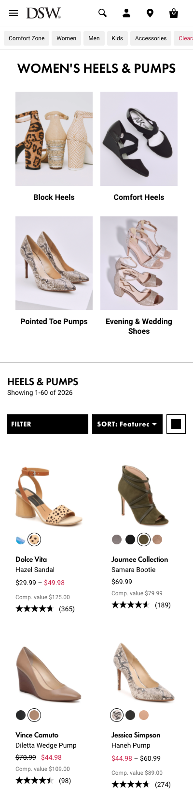
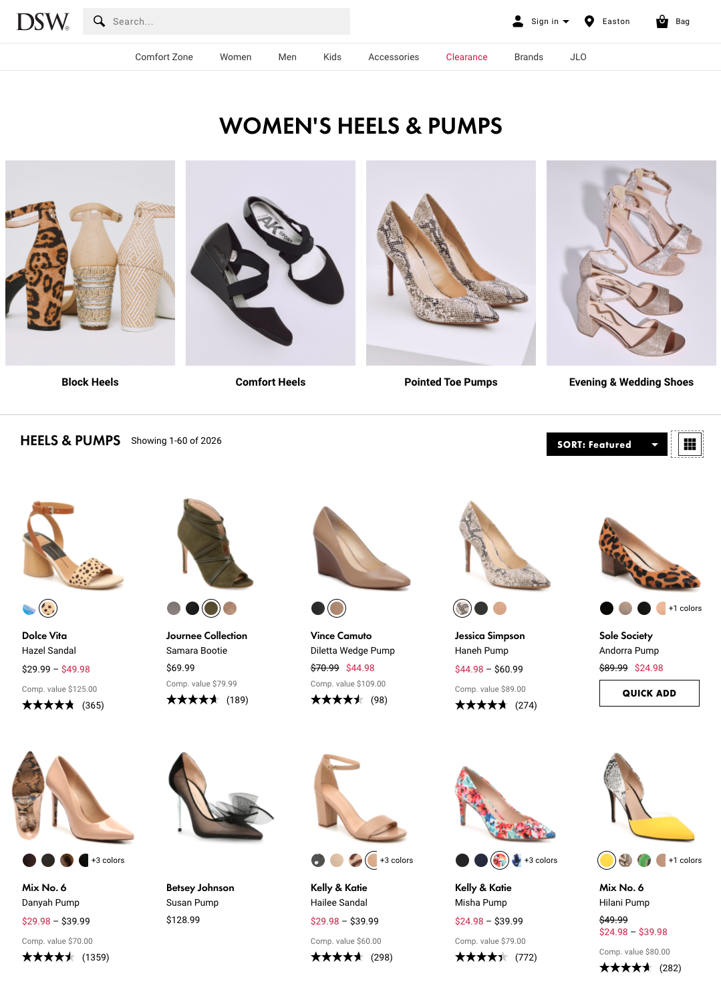

# DSW UI Assessment Project

The goal of this exercise is to showcase your knowledge and skill developing a web application using modern front-end technologies. The package.json file will install [Angular](https://angular.io/) as that is the framework currently used by Designer Brands. However, feel free to use the framework or libraries of your choice, such as [React](https://reactjs.org/) or [Vue](https://vuejs.org/), to complete the assessment.

## Guidelines
The following are things to consider when implementing your solution.  All items are not required.  This list is meant to provide some ideas to explore.

* There is a products.json file that contains data from 10 products that should be output on the collection page.  You can write a service to fetch these products and display them on the page.
* Use DSW fonts.  Fonts are ready for import in the fonts.scss file.
* Utilize RxJS to subscribe to the retrieval of the product JSON
* Create Typescript models for the products.
* Layout the header and make it responsive.
* Use mobile-first development.
* Create unit tests for components/classes you create.
* Anything else you can think of that improves/enhances the solution.

Plan to spend up to 8 hours on this project, but no more.  This isn't about being complete, it's about showing your work, thought process and high-level technical design.

> :exclamation: **Reminder**: You do ***not*** have to implement ***everything***. We realize that completing a fully functional page/application would take far longer than the suggested amount of time.
>
> Hard-coding content is completely acceptable. Feel free to leave notes and comments in the code for areas you would expand on, ideas you would have for further refactoring for making this "ready for production", or simply questions you might have with implementation or design.

You can visit the [actual DSW.com collection page](https://www.dsw.com/en/us/category/womens-dress-pumps-and-sandals/N-1z141jrZ1z13vpxZ1z128uaZ1z128ugZ1z141ju) to look at hover and state behaviors.

## Submission Instructions
1. Read-only access will be granted to this repo by the DBI team.
1. Clone the repo to your local development environment. _(You may need to [add your SSH key to your Github account](https://docs.github.com/en/free-pro-team@latest/github/authenticating-to-github/connecting-to-github-with-ssh))_
1. Complete the assessment to the best of your abilities within a reasonable time window.
1. Zip up your root folder.
    * Exclude `node_modules`, but include `.git` with any commit history made.
1. Send zip file back to DBI team via email.

## General Layouts to Implement
### Mobile
For DSW, this view goes to 767px

### Desktop

## References

### Development server

Run `ng serve` for a dev server. Navigate to `http://localhost:4200/`. The app will automatically reload if you change any of the source files.

### Build

Run `ng build` to build the project. The build artifacts will be stored in the `dist/` directory. Use the `--prod` flag for a production build.

### Running unit tests

Run `ng test` to execute the unit tests via [Karma](https://karma-runner.github.io).

### Running end-to-end tests

Run `ng e2e` to execute the end-to-end tests via [Protractor](http://www.protractortest.org/).

### Further help

To get more help on the Angular CLI use `ng help` or go check out the [Angular CLI README](https://github.com/angular/angular-cli/blob/master/README.md).

___

Happy Coding!

The Designer Brands Web Development Team

:heart: :athletic_shoe:
